## Visual Journey

The Linux kernel offers the best distributions for developers through it's open-source availability, allowing developers to modify critical system files to get programs to work and allowing many developing-related packages to be installed via package managers that anyone can put software on.  

`This visual will help remind me of Tools and their relationship to my Development Journey.`

```mermaid
flowchart LR
    %% GitHub Sources
    subgraph GitHub_Pages[GitHub: Open-Coding-Society/pages]
        A[Repo: pages]:::repo
    end

    subgraph GitHub_Template[GitHub:]
        T[Template Repo: student]:::repo
    end

    subgraph GitHub_Student[GitHub: rsharma5128/student]
        B[Repo: student]:::repo
    end

    %% Local Computer
    subgraph Local[Local Computer]
        subgraph opencs_dir[opencs/ directory]
            C[pages/]:::local
            Ccmd[VSCode Prep<br/><br/>./scripts/venv.sh<br/>source venv/bin/activate<br/>code .]:::cmd
        end
        subgraph user_dir[rsharma5128/ directory]
            D[student/]:::local
            Dcmd[VSCode Prep<br/><br/>./scripts/venv.sh<br/>source venv/bin/activate<br/>code .]:::cmd
        end
    end

    %% Arrows: cloning
    A -.->|clone/pull only| C
    B <--> |clone, pull & push| D

    %% Arrows: template relationship
    T -.->|template→created| B

    %% Arrows: commands
    C --> Ccmd
    D <--> Dcmd
    
```

`This diagram will show what we did over the past few weeks.`

**NOTE:** `For days 1-3, the top-down lines are listed in chronological order(top is the earliest, bottom is the latest)`