## Visual Journey

The Linux kernel offers the best distributions for developers through it's open-source availability, allowing developers to modify critical system files to get programs to work and allowing many developing-related packages to be installed via package managers that anyone can put software on.  

This visual will help remind me of Tools and their relationship to my Development Journey. 

```mermaid
flowchart LR
    %% GitHub Sources
    subgraph GitHub_Pages[GitHub: Open-Coding-Society/pages]
        A[Repo: pages]:::repo
    end

    subgraph GitHub_Template[GitHub: Open-Coding-Society/student]
        T[Template Repo: student]:::repo
    end

    subgraph GitHub_Student[GitHub: rsharma5128/student]
        B[Repo: student]:::repo
    end

    %% Local Computer
    subgraph Local[Local Computer]
        subgraph opencs_dir[opencs/ directory]
            C[pages/]:::local
            Ccmd[VSCode Prep<br/><br/>./scripts/venv.sh<br/>source venv/bin/activate<br/>code .]:::cmd
        end
        subgraph user_dir[rsharma5128/ directory]
            D[student/]:::local
            Dcmd[VSCode Prep<br/><br/>./scripts/venv.sh<br/>source venv/bin/activate<br/>code .]:::cmd
        end
    end

    %% Arrows: cloning
    A -.->|clone/pull only| C
    B <--> |clone, pull & push| D

    %% Arrows: template relationship
    T -.->|template→created| B

    %% Arrows: commands
    C --> Ccmd
    D <--> Dcmd

```

    This diagram will show what we did over the past few weeks.

flowchart LR
    %% GitHub Sources
    subgraph GitHub_Pages[Account Setup]
        A[Created Github Account, discussed PII, created Slack account, enrolled in CS Slack, and cloned Open-Coding Society repository]:::repo
    end

    subgraph GitHub_Template[Template Repo]
        T[GitHub: Open-Coding-Society/student]:::repo
    end

    subgraph GitHub_Student[Student Repo]
        B[GitHub: rsharma5128/student]:::repo
    end

    %% Local Computer
    subgraph Local[Operating System Setup & Local Environment]
        
        %% This node holds the detailed description that was causing the error
        SetupDetails[**OS Setup:** Installed/Set up different ways of accessing Linux distributions.]:::local

        subgraph opencs_dir[opencs/ pages directory]
            C[pages/ local clone]:::local
            Ccmd[VSCode Prep  ./scripts/venv.sh source venv/bin/activate code .]:::cmd
        end
        subgraph user_dir[rsharma5128/ student directory]
            D[student/ local clone]:::local
            Dcmd[VSCode Prep  ./scripts/venv.sh source venv/bin/activate code .]:::cmd
        end
    end

    %% Arrows: structure and flow
    
    A --> SetupDetails
    SetupDetails --> C
    
    T --> B
    B <--> D

    C --> Ccmd
    D --> Dcmd